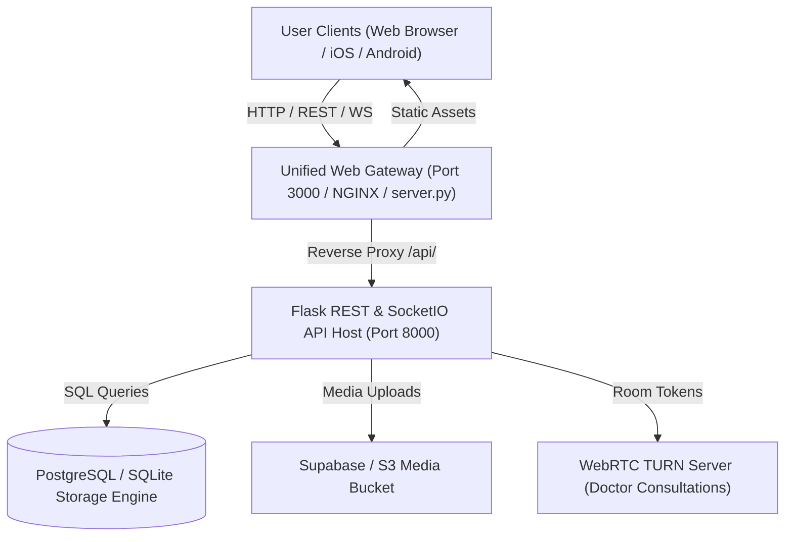
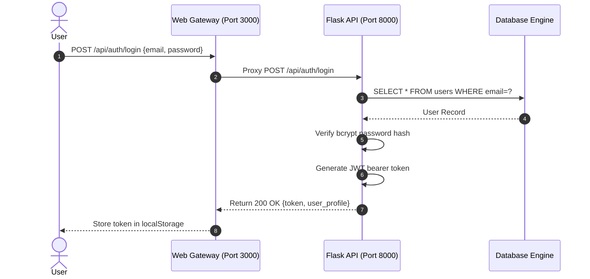
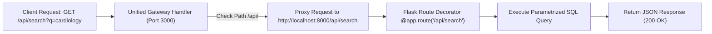
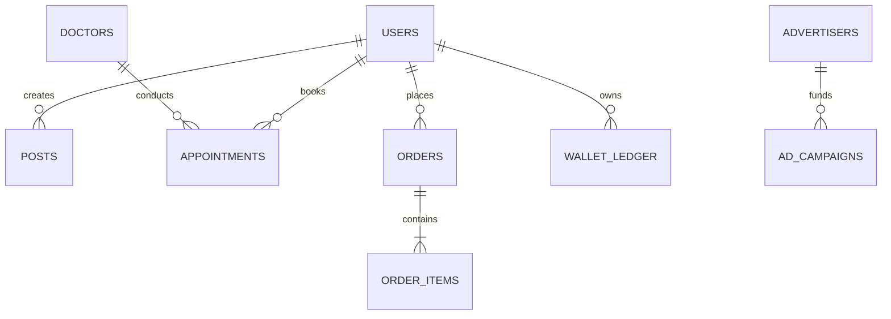
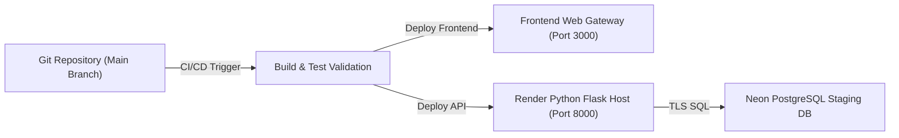

# 🏗️ JORNIZ — Platform Architecture & System Specification

**Project:** Jorniz (Healthcare Social Network + Creator Economy + Wallet + Doctor Consultations + Marketplace)  
**Author:** Jorniz Senior Engineering Team  
**Milestone:** Week 1 — Architecture & System Specification  

---

## 1. High-Level System Architecture

---

## 2. Authentication & Authorization Flow

---

## 3. API & Proxy Request Lifecycle

---

## 4. Database Schema & Entity Relationship Overview

---

## 5. Deployment Pipeline & Staging Architecture

