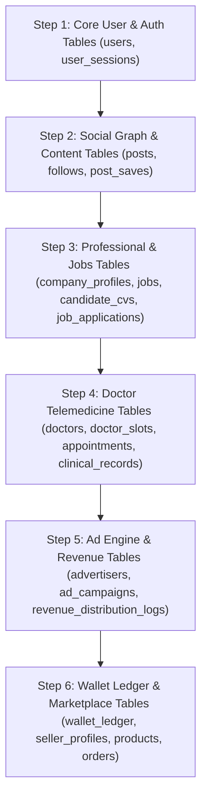

# 🔄 JORNIZ — Database Migration Plan & Strategy

**Project:** Jorniz Platform  
**Target Environments:** Local (SQLite) $\rightarrow$ Staging (PostgreSQL 15+) $\rightarrow$ Production (PostgreSQL 15+ Managed Cluster)  

---

## 1. Zero-Downtime Migration Principles

1. **Non-Destructive Modifications**: Column additions must provide default values (`DEFAULT 'Patient'`) or allow `NULL`. Existing production data is never dropped or overwritten.
2. **Idempotent Migration Scripts**: Schema initialization scripts use `CREATE TABLE IF NOT EXISTS` and `ALTER TABLE ... ADD COLUMN` inside safety blocks.
3. **Double-Entry Ledger Integrity**: Financial balance calculations derive dynamically from `wallet_ledger` entries; legacy direct column modifications are deprecated.

---

## 2. Migration Execution Order

---

## 3. Automated Migration Runner

- **Local Execution**: `python backend/database_schema.py` auto-detects database engine (SQLite vs PostgreSQL via `DATABASE_URL`) and applies all pending table & column additions.
- **Rollback Protocol**: All structural DDL migrations are versioned with rollback scripts stored in `backend/migrations/`.
