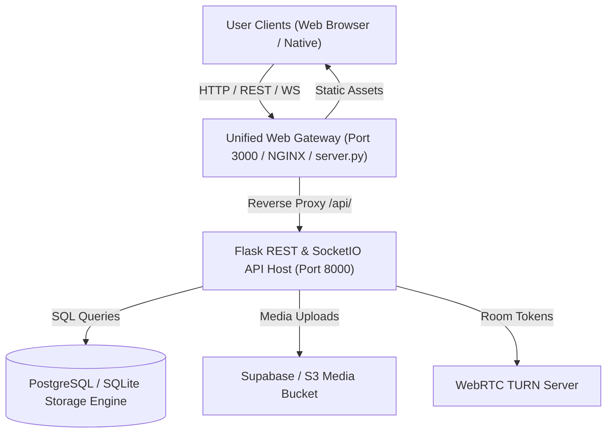
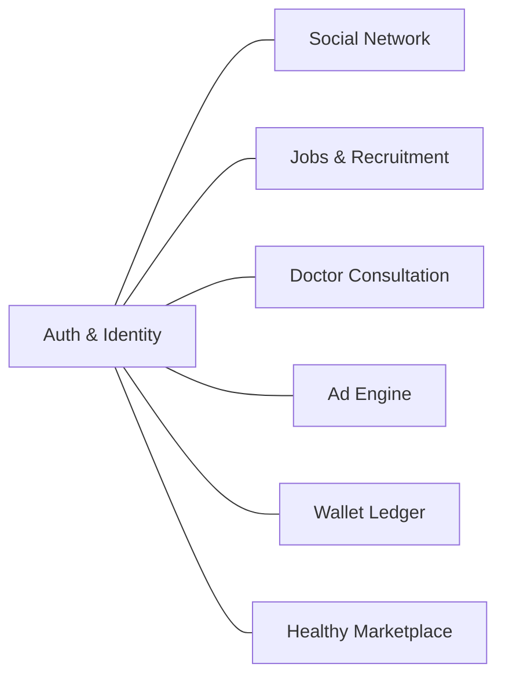
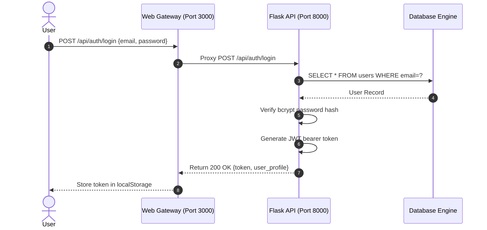
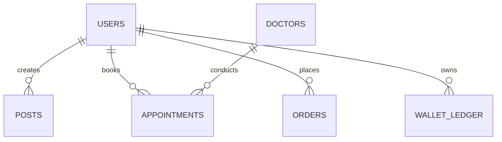
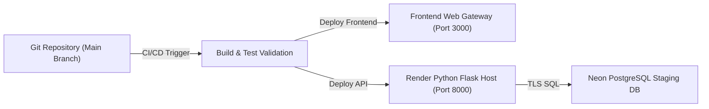

# 🏛️ JORNIZ — Production Architecture Specification

## 1. System Architecture Diagram

---

## 2. Backend Modules Overview

---

## 3. Authentication Flow Diagram

---

## 4. Database Flow Diagram

---

## 5. Deployment Pipeline Diagram

