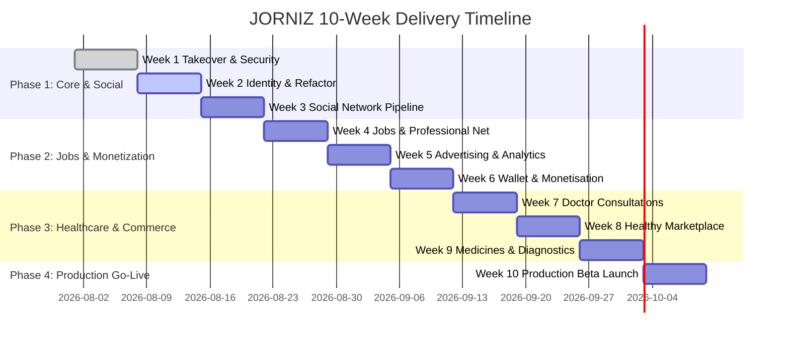

# 📋 JORNIZ — Approved Sprint Backlog & Architecture (Week 1 Exit Evidence)

**Project:** Jorniz (AI-Native Social & Participation Platform + Creator Economy + Jobs + Consultations + Marketplace)  
**Project Owner:** Kshitiz Srivastava  
**Target Delivery Window:** 10 Weeks / 2.5 Months (Accelerated Execution)  
**Milestone Approval Status:** Approved for Week 1 Handover  

---

## 1. Role-Permission Matrix (SOW Section 3 Mandatory Deliverable)

The platform enforces 11 distinct user roles across server-side APIs:

| Role ID | Role Name | View Content | Create Posts | Apply / Recruit Jobs | Book / Offer Consultations | Wallet Spending | Wallet Payouts | Admin Moderation | Finance Access |
|---|---|---|---|---|---|---|---|---|---|
| **R1** | General User | ✅ | ✅ | Candidate | Book Patient | ✅ Rewards | ❌ KYC Required | ❌ | ❌ |
| **R2** | Creator | ✅ | ✅ | Candidate | Book Patient | ✅ Rewards | ✅ Eligible | ❌ | ❌ |
| **R3** | Job Seeker | ✅ | ✅ | Candidate | Book Patient | ✅ Rewards | ❌ | ❌ | ❌ |
| **R4** | Recruiter / Employer | ✅ | ✅ | Employer | N/A | ✅ Corporate | N/A | ❌ | ❌ |
| **R5** | Doctor | ✅ | ✅ | N/A | Offer Doctor | ✅ Earnings | ✅ Eligible | ❌ | ❌ |
| **R6** | Seller / Brand | ✅ | N/A | N/A | N/A | ✅ Vendor | ✅ Settlements | ❌ | ❌ |
| **R7** | Pharmacy Partner | ✅ | N/A | N/A | N/A | ✅ Pharmacy | ✅ Settlements | ❌ | ❌ |
| **R8** | Diagnostic Partner | ✅ | N/A | N/A | N/A | ✅ Diagnostic | ✅ Settlements | ❌ | ❌ |
| **R9** | Advertiser | ✅ | Ads | N/A | N/A | ✅ Prepaid | N/A | ❌ | ❌ |
| **R10**| Moderator | ✅ | Moderation | N/A | N/A | ❌ | ❌ | ✅ Audit/Ban | ❌ |
| **R11**| Super / Finance Admin | ✅ | All | All | All | ✅ Full | ✅ Approvals | ✅ Full | ✅ Full Ledger |

---

## 2. 10-Week Accelerated Delivery Roadmap

### Detailed Week-by-Week Backlog

#### Week 1: Takeover, Audit & Security (Current)
- [x] Transfer repository, database, and cloud account credentials under founder control.
- [x] Perform security audit and rotate secrets (`SECURITY_AUDIT_REPORT.md`, `ASSET_CREDENTIAL_REGISTER.md`).
- [x] Map working vs. fake flows (`WORKING_VS_FAKE_FLOWS_MAP.md`).
- [x] Verify local and staging execution environments (`STAGING_DEPLOYMENT_GUIDE.md`).

#### Week 2: Core Identity & Platform Refactor
- [ ] Implement modular authentication service (`auth_service.py`).
- [ ] Enforce 11-role permission matrix server-side via `@require_role`.
- [ ] Add 2FA for Super Admin and Finance Admin roles.
- [ ] Configure multi-device session list and "log out all devices" API.

#### Week 3: Social Network Completion
- [ ] Implement short video/reel, story, poll, and link post models.
- [ ] Build search index across users, posts, hashtags, and medical categories.
- [ ] Integrate resumable media upload pipeline with thumbnail generation.
- [ ] Implement follow/unfollow social graph with block/mute lists.

#### Week 4: Jobs and Professional Network (Module B)
- [ ] Candidate professional profile with multi-version CV privacy controls.
- [ ] Recruiter job creation, candidate pipeline tracking (Submitted -> Interview -> Hired).
- [ ] Interview scheduling invitations and candidate data retention controls.

#### Week 5: Advertising and Analytics (Module D)
- [ ] Advertiser verification and prepaid budget balance manager.
- [ ] CPM/CPC impression/click tracking with invalid traffic filtering.
- [ ] Implement required economic formula: `Eligible Net Revenue = Gross Revenue - Taxes - Charges - Refunds - Costs`.

#### Week 6: Wallet and Monetisation (Module E)
- [ ] Immutable double-entry transaction ledger schema (`wallet_ledger` table).
- [ ] Value types separation: Real-Money, Health Rewards, Promotional Credits, Cashback.
- [ ] Concurrency locks & idempotency key validation for double-spend prevention.

#### Week 7: Doctor Consultations (Module C)
- [ ] Verified doctor onboarding, qualifications, medical registration review queue.
- [ ] Atomic calendar slot locking (`SELECT FOR UPDATE`) to eliminate double booking.
- [ ] Telemedicine video/chat session integration with TURN server and private consultation notes.

#### Week 8: Healthy Products Marketplace (Module F)
- [ ] Marketplace catalog, nutrition/ingredient disclosure, split checkout (Wallet + UPI).
- [ ] Seller onboarding, inventory, batch tracking, and automated seller settlement ledger.

#### Week 9: Medicines and Diagnostics (Modules G & H)
- [ ] Licensed pharmacy partner onboarding & prescription upload verification workflow.
- [ ] Diagnostic test booking, home sample collection slot management, private PDF report delivery.

#### Week 10: Hardening and Production Launch
- [ ] End-to-end regression testing across all 20 Final Acceptance Tests (A1 to A20).
- [ ] Automated backup & restoration validation.
- [ ] Production deployment and handover of signed final acceptance matrix.

---

## 3. Database Schema & Migration Plan (PostgreSQL)

### Core Schema Tables Summary
1. `users`: ID, name, email, password_hash, role, specialty, verification_doc_url, is_verified, created_at
2. `wallet_ledger`: id, wallet_id, user_id, credit, debit, value_type, idempotency_key, created_at
3. `posts`: id, user_id, content, category, media_url, media_type, likes_count, created_at
4. `jobs`: id, employer_id, title, description, location, salary_range, status, created_at
5. `job_applications`: id, job_id, candidate_id, cv_url, status, applied_at
6. `doctor_slots`: id, doctor_id, slot_time, price, is_booked, booked_by_user_id
7. `consultations`: id, booking_id, doctor_id, patient_id, status, prescription_url, notes
8. `orders`: id, buyer_id, total_amount, wallet_spent, gateway_spent, status, created_at

---
*Approved by Kshitiz Srivastava for Jorniz Platform Development.*
